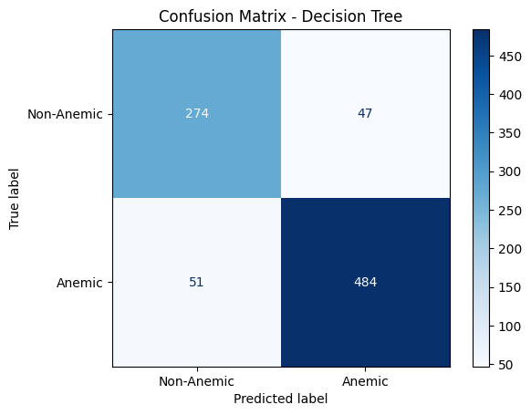

# Klasifikasi Anemia menggunakan Decision Tree

Proyek ini merupakan bagian dari tugas praktikum *Machine Learning* yang bertujuan untuk melakukan klasifikasi kondisi anemia berdasarkan citra sel darah. Dataset yang digunakan terdiri dari dua kelas, yaitu **anemic** dan **nonanemic**, dengan total 4.277 gambar.

Model yang digunakan adalah **Decision Tree Classifier** yang dilatih dengan data citra sel darah yang telah melalui proses preprocessing dan normalisasi.

📌 Penjelasan lengkap mengenai latar belakang, metode, eksplorasi data, serta evaluasi model tersedia dalam file laporan teknis berikut:

📄 [Technical Report](TechnicalReport_PrakMLUTS_YanStephen_ArshandaG_W6.pdf)

---

## 📂 Struktur Proyek

- **assets/**  
  Menyimpan gambar visualisasi hasil dari model dan dataset:
  - `5sample.png`: Lima contoh gambar dari dataset yang digunakan.
  - `akurasiDT.png`: Visualisasi hasil akurasi model Decision Tree.
  - `ConfusionMatrix.png`: Confusion Matrix yang menggambarkan hasil prediksi model.
  - `distribusiLabel.png`: Visualisasi distribusi label *anemic* dan *nonanemic*.
  - `ROCCurve.png`: Visualisasi ROC Curve untuk mengevaluasi kinerja model.

- **dataset/**  
  Berisi dataset gambar yang digunakan dalam klasifikasi:
  - Folder ini berisi gambar-gambar dengan dua kategori:
    - **anemic**: Gambar sel darah dari penderita anemia.
    - **nonanemic**: Gambar sel darah dari orang yang tidak menderita anemia.

- **01_ML_LP_6-Pra-UTS.ipynb**  
  Notebook Jupyter yang berisi implementasi kode untuk proyek ini, mulai dari preprocessing data, pelatihan model, hingga evaluasi kinerja.

- **TechnicalReport_PrakMLUTS_YanStephen_ArshandaG_W6.pdf**  
  Laporan teknis yang menjelaskan metodologi, eksperimen, dan hasil dari proyek ini secara mendetail.

---

## Langkah Utama Proyek

- **Exploratory Data Analysis (EDA):**  
  Meliputi pemuatan dataset, pengecekan gambar rusak, distribusi label, dan visualisasi sampel gambar.

- **Preprocessing:**  
  Gambar diubah menjadi array numerik, dinormalisasi, dan disiapkan dalam bentuk vektor untuk pemodelan.

- **Modeling:**  
  Penggunaan *Decision Tree Classifier* dengan evaluasi akurasi, confusion matrix, dan ROC curve.

---

## 🧑‍🔬 Deskripsi Dataset

Dataset yang digunakan terdiri dari 4.277 gambar yang dibagi menjadi dua kategori:

- **Anemic (Anemia):**  
  Gambar yang menggambarkan sel darah penderita anemia. Gambar ini memiliki karakteristik visual seperti sel yang lebih pucat dan ukuran yang tidak konsisten.

- **Nonanemic (Sehat):**  
  Gambar yang menggambarkan sel darah orang yang tidak menderita anemia. Sel darah ini memiliki bentuk dan ukuran yang lebih konsisten dengan warna merah normal.

Distribusi gambar dalam dataset adalah sebagai berikut:
- Total gambar: 4.277
- Gambar anemic: 2.563
- Gambar nonanemic: 1.714

Dataset ini digunakan untuk melatih dan menguji model klasifikasi *Decision Tree*, yang diharapkan dapat membedakan antara sel darah yang sehat dan yang menderita anemia berdasarkan citra mikroskopik.

---

## 🖼️ Visualisasi

### Distribusi Label
Visualisasi distribusi jumlah gambar antara kelas *anemic* dan *nonanemic*:

---

### Contoh Gambar Sampel
Lima gambar awal dari dataset:

---

### Akurasi Model
Hasil akurasi model Decision Tree setelah evaluasi terhadap data uji:

---

### Confusion Matrix
Matriks perbandingan hasil prediksi dan label asli:

---

### ROC Curve
Visualisasi kinerja model terhadap rasio *true positive* dan *false positive*:

---

##  Catatan

Dokumentasi teknis dan analisis lebih lanjut tersedia pada laporan PDF.  
Proyek ini disusun sebagai tugas mandiri dalam mata kuliah *Praktikum Machine Learning*.
